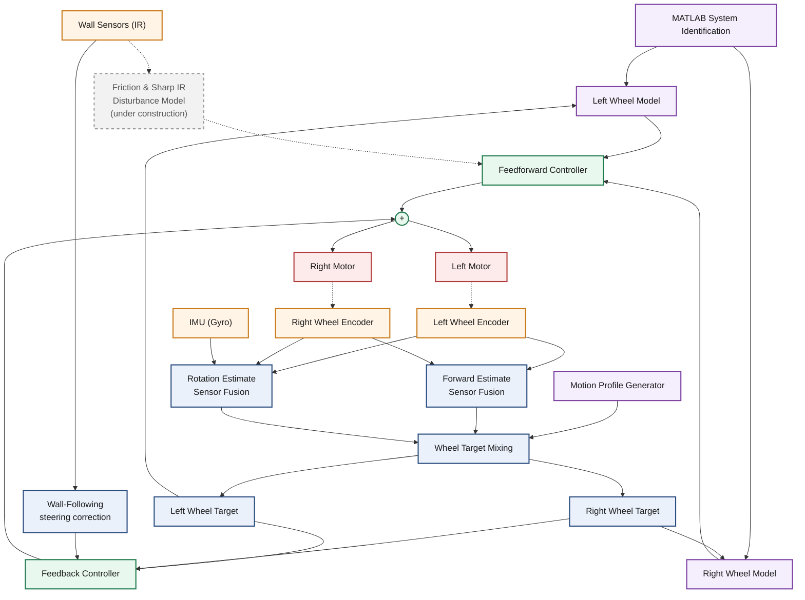

# Micromouse — Autonomous Maze Solving Robots

An ongoing Micromouse robotics project focused on developing high-speed autonomous maze-solving robots, from custom electronics and mechanical design to embedded firmware, motion control, state estimation, and path planning.

This repository documents the evolution of the platform across multiple generations, including **Chia v1**, **Chia v2**, and **Blaze v1**.

---

## 🤖 Project Overview

Micromouse is an autonomous robotics challenge where a small mobile robot must explore and solve a maze without human intervention.

This project focuses on developing a complete high-performance Micromouse platform capable of:

- Real-time maze exploration and mapping
- Flood-fill based path planning
- High-speed autonomous navigation
- Precise motion control
- Encoder-based velocity estimation
- Sensor-based wall detection
- State estimation using Kalman filtering
- PID feedback control
- Feedforward motor control
- Trapezoidal motion profiles
- Custom PCB and electronics design
- Embedded firmware development

The robot is designed to navigate a **16×16 maze** while maintaining accurate position, velocity, and heading control.

---

# 🚗 Robot Generations

The project has evolved through several generations, with each version introducing improvements in hardware, electronics, firmware, and motion control.

## Chia v1 — First Generation

<p align="center">
  
</p>

The first-generation Micromouse platform was developed around a **Teensy 4.1** microcontroller.

### Key Features

- Teensy 4.1 microcontroller
- Custom electronics
- Embedded firmware
- Wall-detection sensors
- Encoder-based motor control
- Autonomous maze navigation
- Custom mechanical platform

Chia v1 established the initial hardware and software architecture for the Micromouse platform.

---

## Chia v2 — Second Generation

<p align="center">
  
  
</p>

Chia v2 introduced a more compact and integrated electronics platform while improving the mechanical and electrical design.

### Key Features

- Teensy 4.1 microcontroller
- Custom-designed 2-layer PCB
- 1000 RPM DC motors
- Integrated motor drivers
- Sensor interfaces
- Power-management circuitry
- Improved mechanical design
- Embedded motion-control firmware

### PCB

<p align="center">
  
</p>

The Chia v2 PCB integrates the microcontroller interface, motor drivers, sensor interfaces, and power-management circuitry into a compact electronics platform.

---

## Blaze v1 — Third Generation

<p align="center">
  
</p>

Blaze v1 is the third-generation Micromouse platform, developed with a stronger focus on high-speed autonomous navigation and optimized motion control.

### Key Features

- STM32 microcontroller
- Custom-designed 4-layer PCB
- Lightweight mechanical redesign
- High-speed DC motors
- Advanced motion control
- Sensor fusion
- Motion profiling
- Optimized embedded firmware
- High-speed autonomous navigation

The platform is designed for competitive Micromouse applications, with emphasis on smooth, accurate, and high-speed movement through the maze.

### Controller, at a glance

Blaze v1's motion controller runs a closed-loop feedback/feedforward scheme on both the
forward and rotational axes, tracking smooth (non-abrupt) speed profiles rather than
stepping directly to a target velocity. Wheel encoders provide the primary velocity
feedback; an onboard IMU is fused in to improve heading accuracy, and wall-sensor
readings contribute a steering correction to keep the robot centered while traveling
through the maze. No further implementation detail is shared publicly at this stage.



### PCB

> Due to project confidentiality before competitions, only selected PCB design details are publicly shared.

---

# 🧠 Software & Control

The robot uses a layered control architecture combining low-level motor control with higher-level navigation algorithms.

### Maze Mapping

The robot continuously builds an internal representation of the maze using its wall sensors.

### Flood-Fill Path Planning

Flood-fill is used to calculate distances to the goal and determine efficient paths through the explored maze.

### Motion Profiling

Motion profiles are used to control acceleration, constant-speed motion, and deceleration instead of applying abrupt velocity commands.

### PID Motor Control

Closed-loop motor control uses encoder feedback to regulate wheel velocity.

The control system incorporates both:

- Feedback control
- Feedforward control

This allows the robot to achieve faster and more accurate velocity tracking.

### State Estimation

Sensor measurements are combined using a **Kalman filter** to improve estimates of the robot's motion state.

### System Identification

MATLAB-based modelling and experimental measurements are used to characterize motor behaviour and tune the motion-control system.

---

# 🔧 Hardware

| Generation | Microcontroller | PCB | Motor |
|------------|-----------------|-----|-------|
| Chia v1 | Teensy 4.1 | Custom electronics | DC motors |
| Chia v2 | Teensy 4.1 | Custom 2-layer PCB | 1000 RPM DC motors |
| Blaze v1 | STM32 | Custom 4-layer PCB | High-speed DC motors |

---

# 🛠️ Technologies

### Embedded Systems
- C
- C++
- STM32
- Teensy 4.1
- Embedded firmware
- Encoder interfaces
- Motor control

### Robotics & Control
- PID control
- Feedforward control
- Motion profiling
- State estimation
- Kalman filtering
- Differential-drive kinematics

### Navigation
- Maze mapping
- Flood-fill path planning
- Autonomous exploration
- Optimal path planning

### Electronics & Design
- Altium Designer
- Custom PCB design
- Motor drivers
- Sensor interfaces
- Power management

### Modelling & Tuning
- MATLAB
- System identification
- Experimental characterization
- Controller tuning

---

# 🏆 Competition

The Micromouse platform has been developed for autonomous robotics competitions, including **Micromaze 2.0 at IIT**, where the team was selected among the **Top 10 finalists**.

The system is continuously being improved toward faster exploration, more accurate motion control, and optimized maze-solving performance.

---

# 📸 Project Gallery

## Blaze v1 — Third Generation

<p align="center">
  
</p>

## Chia v2 — Second Generation

<p align="center">
  
  
</p>

## Chia v2 PCB

<p align="center">
  
</p>

## Chia v1 — First Generation

<p align="center">
  
</p>

---

# 📁 Repository Structure

```text
.
├── gallery/
│   ├── blaze v1 (pcb).jpg
│   ├── chia v1 (pcb).jpeg
│   ├── chia v1.jpeg
│   ├── chia v2.jpeg
│   └── IMG_3780.png
│
├── Chia_v1/
│   ├── Firmware/
│   ├── Hardware/
│   └── Documentation/
│
├── Chia_v2/
│   ├── Firmware/
│   ├── PCB/
│   ├── CAD/
│   └── Documentation/
│
├── Blaze_v1/
│   ├── Firmware/
│   ├── PCB/
│   ├── CAD/
│   └── Documentation/
│
└── README.md
```
